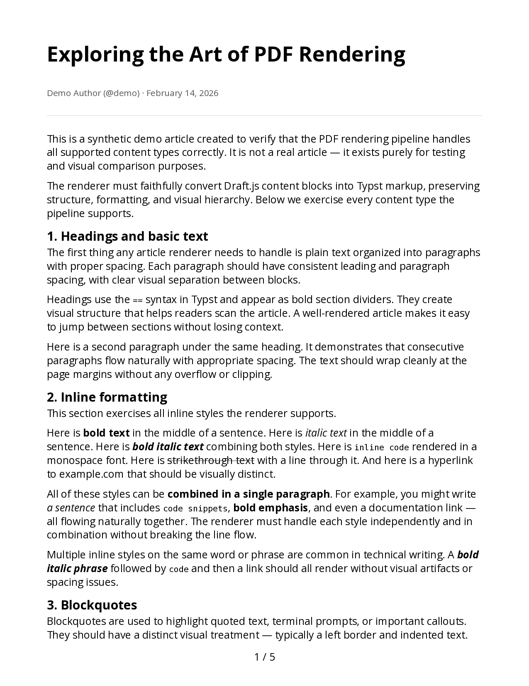
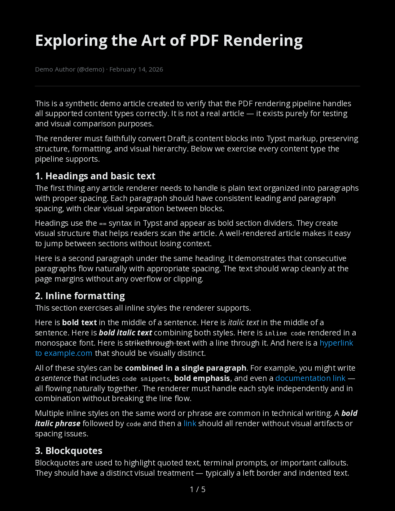

# X Article Exporter

Export [X (Twitter) articles](https://help.x.com/en/using-x/articles) as high-quality PDFs — with optional translation and dark mode.


## Screenshot

<table>
<tr>
<td></td>
<td></td>
</tr>
<tr>
<td align="center">Light mode</td>
<td align="center">Dark mode</td>
</tr>
</table>

## Features

- **CLI** — Export any X article URL to PDF from the terminal
- **Translation** — Translate articles via local [Ollama](https://ollama.com) + [translategemma](https://ollama.com/library/translategemma) (55+ languages)
- **Dark mode** — Black-background rendering matching X's dark theme
- **HTTP API** — Self-hosted server with async job processing, rate limiting, and bearer auth
- **MCP server** — Use as a [Claude Code](https://docs.anthropic.com/en/docs/claude-code) tool to export articles from conversation
- **Quality validation** — Structural PDF checks via [pdfcpu](https://github.com/pdfcpu/pdfcpu) + text extraction verification

## Prerequisites

- [Go 1.25+](https://go.dev/dl/)
- [Typst](https://typst.app) — PDF rendering (`brew install typst` on macOS)
- [Ollama](https://ollama.com) + `translategemma:12b` — optional, only needed for translation

## Installation

```sh
go install github.com/annismckenzie/x-article-exporter@latest
```

Or build from source:

```sh
git clone https://github.com/annismckenzie/x-article-exporter.git
cd x-article-exporter
go build -o x-article-exporter .
```

### Docker

A multi-stage `Dockerfile` is included. The runtime image bundles the external
[Typst](https://typst.app) binary and fonts (DejaVu, Noto, Noto CJK), so no host
dependencies are required.

```sh
# Build the image
docker build -t x-article-exporter:latest .

# Print help
docker run --rm x-article-exporter:latest --help
```

Run an export, mounting an output directory and your config (auth) read-only:

```sh
docker run --rm \
  -v "$PWD/out:/out" \
  -v "$PWD/cfg:/root/.config/x-article-exporter:ro" \
  x-article-exporter:latest \
  --output-dir /out --file-name test \
  https://x.com/user/article/1234567890
# writes /out/test.pdf and /out/test.html  (./out/test.{pdf,html} on the host)
```

Inside the container (running as `root`):

- Auth config is read from `/root/.config/x-article-exporter/config.yaml`
  (keys `auth_token` and `ct0`).
- The GraphQL query-id cache lives at `/root/.cache/x-article-exporter/query-id.json`
  (mount a volume there to persist it across runs).

## Quick Start

### 1. Get auth cookies

Open [x.com](https://x.com) in your browser, then:

1. Open DevTools (F12 or Cmd+Option+I)
2. Go to **Application** > **Cookies** > `https://x.com`
3. Copy the values of `auth_token` and `ct0`

### 2. Create a config file

Save to `~/.config/x-article-exporter/config.yaml`:

```yaml
auth_token: "your-auth-token"
ct0: "your-ct0"
```

### 3. Export an article

```sh
x-article-exporter https://x.com/user/article/1234567890
```

This creates a PDF in the current directory named after the article title.

## Configuration

All settings go in `~/.config/x-article-exporter/config.yaml`. CLI flags override config values.

```yaml
# Required: X authentication cookies (get from browser dev tools)
auth_token: "your-auth-token"
ct0: "your-ct0"

# Optional: Ollama model for translation (default: translategemma:12b)
# ollama_model: "translategemma:12b"

# Optional: Render PDFs in dark mode
# dark_mode: true

# Server mode configuration (used with --serve)
server:
  port: 8080
  host: "127.0.0.1"
  job_ttl_minutes: 60
  default_rate_limit_per_hour: 20
  max_concurrent_jobs: 4
  api_keys:
    - key: "your-api-key-here"
      name: "default"
      # rate_limit_per_hour: 20  # omit to use default_rate_limit_per_hour
```

See [`config.example.yaml`](config.example.yaml) for the full reference.

## Usage

### CLI

```
x-article-exporter [flags] <article-url>
```

| Flag | Description |
|------|-------------|
| `-auth-token` | X `auth_token` cookie (overrides config) |
| `-ct0` | X `ct0` cookie (overrides config) |
| `-translate` | Translate to target language (e.g. `de`, `fr`, `ja`) |
| `-dark` | Render PDF in dark mode |
| `-output` | Output PDF path (default: `./{title}.pdf`) |
| `--output-dir` | Directory to write outputs into (used with `--file-name`) |
| `--file-name` | Base output filename **without** extension (used with `--output-dir`) |
| `-query-id` | GraphQL query ID override (auto-resolved if omitted) |
| `-ollama-model` | Ollama model for translation (default: `translategemma:12b`) |

The tool always writes two files for an export: `<base>.html` and `<base>.pdf`.
The output base is resolved with the following precedence:

1. `--output-dir` + `--file-name` (when **both** are set) → `<output-dir>/<file-name>`
2. `-output` (legacy) → the given path with a trailing `.pdf` stripped
3. neither set → a sanitized version of the article title in the current directory

The output directory is created automatically if it does not exist. The
`-output` flag continues to work exactly as before for standalone use; when
`--output-dir`/`--file-name` are both provided they take precedence over it.

**Examples:**

```sh
# Basic export
x-article-exporter https://x.com/elonmusk/article/1234567890

# Translate to German
x-article-exporter -translate de https://x.com/elonmusk/article/1234567890

# Dark mode with custom output path
x-article-exporter -dark -output ~/Documents/article.pdf https://x.com/elonmusk/article/1234567890

# Explicit output directory + base file name (writes article.html and article.pdf)
x-article-exporter --output-dir ~/Documents/exports --file-name article https://x.com/elonmusk/article/1234567890
```

### Resilient HTML + PDF output

HTML and PDF are decoupled. The HTML file is **always** written. The PDF is
written only when the Typst compile succeeds. If PDF generation fails (for
example, when the article prose contains markup that Typst cannot compile), the
tool prints a warning, keeps the HTML, and **exits 0**:

```
warning: PDF generation failed, HTML written: typst compile: exit status 1
HTML written to article.html
```

The process exits non-zero only when the HTML itself cannot be produced or
written.

### HTTP API

Start the server:

```sh
x-article-exporter --serve
```

Export workflow:

```sh
# Submit an article for export
curl -X POST -H "Authorization: Bearer your-api-key" \
  -H "Content-Type: application/json" \
  -d '{"url":"https://x.com/user/article/123"}' \
  http://localhost:8080/export

# Check job status
curl -H "Authorization: Bearer your-api-key" \
  http://localhost:8080/export/{id}

# Download the PDF
curl -H "Authorization: Bearer your-api-key" \
  http://localhost:8080/export/{id}/pdf -o article.pdf
```

See [`API.md`](API.md) for full endpoint reference with request/response schemas.

### MCP Server (Claude Code)

Register as a Claude Code tool:

```sh
claude mcp add x-article-exporter /path/to/x-article-exporter -- --mcp
```

Then ask Claude: *"Export this article as a PDF: https://x.com/user/article/123"*

See [`docs/mcp-setup.md`](docs/mcp-setup.md) for the full setup guide, available tools, and troubleshooting.

## How It Works

1. **Extract** — Fetches the article via X's GraphQL API (`TweetResultByRestId`), parses the Draft.js content model
2. **Translate** *(optional)* — Sends text blocks in batches to a local Ollama instance running translategemma
3. **Render** — Generates Typst source from the article model, compiles to PDF with embedded fonts and images
4. **Validate** — Runs structural checks with pdfcpu and verifies text extraction

## Contributing

```sh
# Run tests
make test

# Run end-to-end test (requires auth config)
make test-article

# Visual preview (generates PDF + PNGs)
make preview
make preview-dark
```

Architecture and design documents are in [`shaping/`](shaping/).

## License

[MIT](LICENSE)
