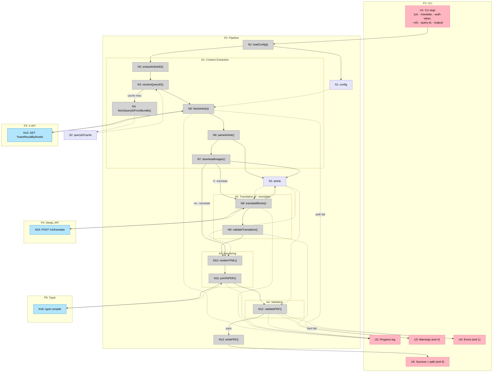

# Shape A — Breadboard

## Context

Go CLI tool with a linear pipeline: load config → extract article from X → (optionally) translate via Ollama → render to PDF via Typst → validate PDF → write to disk. The user interacts entirely through the terminal (CLI args in, progress/errors/output path out).

---

## Places

| #   | Place      | Description                                                                                              |
| --- | ---------- | -------------------------------------------------------------------------------------------------------- |
| P1  | CLI        | Terminal — user invokes command, sees progress, errors, and output path                                  |
| P2  | Pipeline   | Core processing: config → extraction → translation → rendering → validation → output                     |
| P3  | X API      | External: `x.com/i/api/graphql/` (article data) and `abs.twimg.com` (JS bundles for query ID extraction) |
| P4  | DeepL API  | External: `api-free.deepl.com/v2/translate`                                                              |
| P5  | Typst      | External: `typst compile` binary for PDF rendering                                                       |
| P6  | Filesystem | Config file (`~/.config/x-article-exporter/config.yaml`), query ID cache, output PDF                     |

---

## UI Affordances

| #   | Place | Affordance                                                                                                                                           | Control | Wires Out | Returns To |
| --- | ----- | ---------------------------------------------------------------------------------------------------------------------------------------------------- | ------- | --------- | ---------- |
| U1  | P1    | CLI invocation: `x-article-exporter <url> [--translate <lang>] [--auth-token <t>] [--ct0 <c>] [--query-id <id>] [--deepl-key <k>] [--output <path>]` | invoke  | → N1      | —          |
| U2  | P1    | Progress log ("Fetching article...", "Translating to de...", "Rendering PDF...", "Validating...")                                                    | render  | —         | —          |
| U3  | P1    | Validation warnings (word count ±15%, translation length ±30%) — exit 0                                                                              | render  | —         | —          |
| U4  | P1    | Error messages (auth failure, article not found, validation hard fail) — exit 1                                                                      | render  | —         | —          |
| U5  | P1    | Success message + output file path — exit 0                                                                                                          | render  | —         | —          |

---

## Code Affordances

| #   | Place | Component | Affordance                                                                                                                                                                                                                                                         | Control | Wires Out         | Returns To                             |
| --- | ----- | --------- | ------------------------------------------------------------------------------------------------------------------------------------------------------------------------------------------------------------------------------------------------------------------ | ------- | ----------------- | -------------------------------------- |
| N1  | P2    | config    | `loadConfig(flags, configPath)` — parse CLI flags, read config.yaml from P6, merge (flags override file values)                                                                                                                                                    | call    | reads P6          | → S1                                   |
| N2  | P2    | extract   | `extractArticleID(url)` — parse snowflake ID from `x.com/i/article/{id}` URL                                                                                                                                                                                       | call    | —                 | → N5                                   |
| N3  | P2    | extract   | `resolveQueryID(config)` — check S2 cache (24h TTL); if miss → N4; if `--query-id` flag → use directly                                                                                                                                                             | call    | → N4 (cache miss) | → N5                                   |
| N4  | P3    | extract   | `fetchQueryIDFromBundle()` — GET main.js → find api chunk URL → GET `api.{hash}.js` → regex extract query ID                                                                                                                                                       | call    | —                 | → S2, → N3                             |
| N5  | P2    | extract   | `fetchArticle(articleID, queryID, config)` — build GET with URL-encoded `variables`, `features` (23 flags), `fieldToggles` (`withArticleRichContentState: true`), bearer token, cookie auth                                                                        | call    | → N14             | → N6                                   |
| N6  | P2    | extract   | `parseArticle(response)` — parse JSON envelope (`data.tweetResult.result.article.article_results.result`) → article metadata (title, date, author from tweet wrapper) + Draft.js `content_state` (blocks array, inline styles, entity map as `{key, value}` pairs) | call    | —                 | → S3                                   |
| N7  | P2    | extract   | `downloadImages(blocks)` — fetch image URLs from entity map, base64-encode, embed inline in block model                                                                                                                                                            | call    | —                 | updates S3                             |
| N8  | P2    | translate | `translateBlocks(blocks, targetLang, apiKey)` — XML-wrap translatable blocks, set `ignore_tags` for code/LaTeX, single POST to DeepL, unwrap response, merge back                                                                                                  | call    | → N15             | updates S3                             |
| N9  | P2    | translate | `validateTranslation(original, translated)` — block count match, code block byte-identity (`bytes.Equal`), translation length ratio ±30%                                                                                                                           | call    | —                 | → U3 (soft), → U4 (hard)               |
| N10 | P2    | render    | `renderHTML(article, blocks)` — Go `html/template` renders blocks to HTML with inline CSS for print media (`@media print`, `break-inside: avoid`, page margins, Georgia/monospace font stack)                                                                      | call    | —                 | → N11                                  |
| N11 | P2    | render    | `printToPDF(article, darkMode)` — generate Typst source from article model, decode base64 images to temp dir, write embedded fonts, `typst compile` to PDF                                                                                                         | call    | → N16             | → N12                                  |
| N12 | P2    | validate  | `validatePDF(pdfBytes, article, blocks)` — `pdfcpu.ValidateFile()` (~5ms), `PageCountFile()` > 0, `ExtractImagesRaw()` count matches expected, `ledongthuc/pdf.GetPlainText()` for title/author present + word count ±15%                                          | call    | —                 | → U3 (soft), → U4 (hard), → N13 (pass) |
| N13 | P6    | output    | `writePDF(pdfBytes, outputPath)` — `os.WriteFile(path, pdfBytes, 0644)`                                                                                                                                                                                            | call    | writes to P6      | → U5                                   |
| N14 | P3    | —         | `GET /graphql/{queryId}/TweetResultByRestId` — `authorization: Bearer {token}`, `x-csrf-token: {ct0}`, `cookie: auth_token={auth_token}; ct0={ct0}`                                                                                                                | call    | —                 | → N5                                   |
| N15 | P4    | —         | `POST /v2/translate` — `text`, `target_lang`, `tag_handling: xml`, `ignore_tags: code,latex`                                                                                                                                                                       | call    | —                 | → N8                                   |
| N16 | P5    | —         | `typst compile` — Typst CLI binary renders .typ source to PDF                                                                                                                                                                                                      | call    | —                 | → N11                                  |

---

## Data Stores

| #   | Place | Store          | Description                                                                                                                                                                                        |
| --- | ----- | -------------- | -------------------------------------------------------------------------------------------------------------------------------------------------------------------------------------------------- |
| S1  | P2    | `config`       | Merged configuration: `auth_token`, `ct0`, `output_dir`, `translate_lang`, `deepl_key`, `query_id` (CLI flags override config file)                                                                |
| S2  | P6    | `queryIDCache` | Cached query ID + extraction timestamp, 24h TTL. File: `~/.cache/x-article-exporter/query-id.json`                                                                                                 |
| S3  | P2    | `article`      | In-memory article model: title, author, date, blocks (`[]Block` with text, type, inline styles, entities), images (base64-encoded). Mutated through pipeline: parse → download images → translate. |

---

## Diagram

**Legend:**

- **Pink nodes (U)** = UI affordances (things the user sees/provides)
- **Grey nodes (N)** = Code affordances (functions, handlers)
- **Lavender nodes (S)** = Data stores (persistent or in-memory state)
- **Blue nodes (N14-N16)** = External system boundaries (API calls)
- **Solid lines (→)** = Wires Out (control flow: calls, triggers)
- **Dashed lines (-.->)** = Returns To (data flow: return values, store reads)
