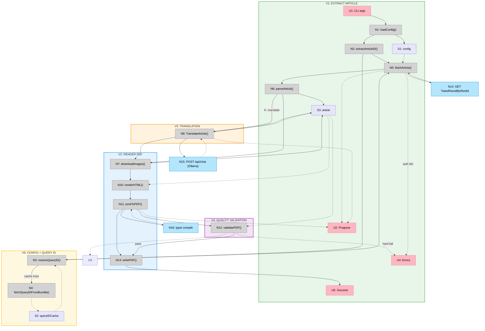

# Shape A — Slices

## Slice Summary

| #   | Slice              | Mechanism                            | Demo                                                                 |
| --- | ------------------ | ------------------------------------ | -------------------------------------------------------------------- |
| V1  | Extract article    | A1 (content extraction)              | "Run command with URL + auth flags, see article summary in terminal" |
| V2  | Render PDF         | A3 (PDF rendering)                   | "Run command, get a well-formatted PDF"                              |
| V3  | Translation        | A2 (translation)                     | "Run with `--translate de`, get German PDF"                          |
| V4  | Quality validation | A4 (quality validation)              | "Run command, see validation pass/warnings before output"            |
| V5  | Config + query ID  | R5, A1 partial (query ID resolution) | "Config file replaces flags, query ID auto-resolves"                 |
| V6  | Web API            | A6 (HTTP API server)                 | "POST URL to API, get PDF back"                                      |
| V7  | Thread export      | A5 (thread extraction + rendering)   | "Pass thread URL, get thread PDF"                                    |

---

## V1: Extract Article

**Demo:** `x-article-exporter https://x.com/i/article/123456 --auth-token abc --ct0 xyz` → prints article title, author, date, block count, image count to terminal.

**Notes:**

- Query ID is hardcoded (will rotate in 2-4 weeks — acceptable for first slice)
- `--auth-token` and `--ct0` are required flags (no config file yet)
- No PDF output — terminal summary only
- No image download (not needed for summary)

**New affordances:**

| #   | Place | Component | Affordance                                                      | Control | Wires Out | Returns To |
| --- | ----- | --------- | --------------------------------------------------------------- | ------- | --------- | ---------- |
| U1  | P1    | —         | CLI args: `<url> --auth-token <t> --ct0 <c>`                    | invoke  | → N1      | —          |
| U2  | P1    | —         | Progress log                                                    | render  | —         | —          |
| U4  | P1    | —         | Error messages (exit 1)                                         | render  | —         | —          |
| U5  | P1    | —         | Article summary (exit 0)                                        | render  | —         | —          |
| N1  | P2    | config    | `loadConfig(flags)` — parse CLI flags only, no config file      | call    | —         | → S1       |
| N2  | P2    | extract   | `extractArticleID(url)`                                         | call    | —         | → N5       |
| N5  | P2    | extract   | `fetchArticle(articleID, queryID, config)` — hardcoded query ID | call    | → N14     | → N6       |
| N6  | P2    | extract   | `parseArticle(response)`                                        | call    | —         | → S3       |
| N14 | P3    | —         | `GET TweetResultByRestId`                                       | call    | —         | → N5       |
| S1  | P2    | —         | `config` (from flags only)                                      | store   | —         | —          |
| S3  | P2    | —         | `article` (metadata + blocks)                                   | store   | —         | → U5       |

---

## V2: Render PDF

**Demo:** `x-article-exporter https://x.com/i/article/123456 --auth-token abc --ct0 xyz --output ./article.pdf` → writes a well-formatted, self-contained PDF to disk.

**Notes:**

- Images downloaded and base64-embedded (MEDIA entities resolved via `media_entities[]`)
- Typst source renderer generates `.typ` from article model, compiled via `typst compile`
- Block grouping: consecutive list items → `- `/`+ `, code blocks → ```` ``` ````, blockquotes → `#block(stroke: (left: ...))[]`
- Boundary-based styled text renderer for Typst markup (`*bold*`, `_italic_`, `` `code` ``, `#strike[]`, `#link()[]`)
- Newlines within styled segments handled by closing/reopening markup at line boundaries
- Embedded Open Sans static TTFs (Regular/Bold/Italic/BoldItalic) + Apple Symbols fallback
- Dark mode via `--dark` flag: `#set page(fill: rgb("#000"))` + `#set text(fill: rgb("#e7e9ea"))`
- Page numbers "1 / 1" centered at bottom, dark mode margins filled with page color
- Self-contained HTML always saved alongside PDF (diffable, shareable via Slack)
- Output file path via `--output` flag (default: `./{title}.pdf` + `.html`)

**New affordances:**

| #   | Place | Component | Affordance                                                    | Control | Wires Out | Returns To |
| --- | ----- | --------- | ------------------------------------------------------------- | ------- | --------- | ---------- |
| N7  | P2    | extract   | `downloadImages(blocks)` — fetch + base64-encode              | call    | —         | updates S3 |
| N10 | P2    | render    | `renderHTML(article, blocks)` — Go template + CSS             | call    | —         | → N11      |
| N11 | P2    | render    | `printToPDF(article, darkMode)` — generate Typst source, `typst compile` | call    | → N16     | → N13      |
| N13 | P6    | output    | `writePDF(pdfBytes, outputPath)`                                         | call    | writes P6 | → U5       |
| N16 | P5    | —         | `typst compile` — Typst binary renders .typ to PDF                       | call    | —         | → N11      |

---

## V3: Translation

**Demo:** `x-article-exporter https://x.com/i/article/123456 --auth-token abc --ct0 xyz --translate de` → PDF in German with code blocks and images preserved unchanged.

**Notes:**

- `--translate <lang>` and `--ollama-model <model>` flags added
- Local Ollama with translategemma:12b (purpose-built translation model, 55 languages, no API key needed)
- Batch translation: 8 blocks per request using `[N]` delimiters to avoid collision with numbered content
- Plain text translation: InlineStyleRanges/EntityRanges cleared on translated blocks (render pipeline handles this gracefully)
- Translatable block types: unstyled, headers, list items, blockquotes. Code blocks and atomic (images) skipped.
- Title translated separately; trailing period stripped if original didn't have one
- ~6 min for a full 70-block article on M3/32GB

**Nice-to-have ideas:**

- **Image text translation**: Images with text (screenshots, diagrams with labels) are not translated. Investigate OCR + overlay or image regeneration approaches. Spike needed to assess feasibility and quality.

**New affordances:**

| #   | Place | Component | Affordance                                                                 | Control | Wires Out | Returns To |
| --- | ----- | --------- | -------------------------------------------------------------------------- | ------- | --------- | ---------- |
| N8  | P2    | translate | `TranslateArticle(article, targetLang, client)` — batch translate in-place | call    | → N15     | updates S3 |
| N15 | local | —         | `POST /api/chat` — Ollama (translategemma:12b)                             | call    | —         | → N8       |

---

## V4: Quality Validation

**Demo:** `x-article-exporter ...` → after PDF render, validation output: "PDF valid. 4 pages. 3 images (expected 3). Title found. Author found. Word count: 1847 (expected ~1800). OK."

**Notes:**

- Runs automatically after every PDF render (<200ms overhead)
- `pdfcpu`: structural integrity, page count, image count
- `ledongthuc/pdf`: text extraction for title/author present, word count ±15%
- U3 extended with PDF validation warnings (word count off, image count mismatch)
- Hard failures (missing title, PDF corrupt) → U4 (exit 1)
- Soft warnings (word count slightly off) → U3 (exit 0)

**Nice-to-have ideas (from V2 E2E feedback):**

- **Per-article settings JSON**: A small JSON file alongside the article that overrides rendering settings (e.g., image max-width, page break locations, font size tweaks) for per-article taste adjustments. Each article has unique "sharp edges" that only manual tweaks can fix.
- **Golden file testing**: Use the HTML output (pre-PDF) as golden files for regression/integration tests. The HTML is clean and deterministic, making it ideal for diffing.

**New affordances:**

| #   | Place | Component | Affordance                                                         | Control | Wires Out | Returns To        |
| --- | ----- | --------- | ------------------------------------------------------------------ | ------- | --------- | ----------------- |
| N12 | P2    | validate  | `validatePDF(pdfBytes, article, blocks)` — pdfcpu + ledongthuc/pdf | call    | —         | → U3, → U4, → N13 |

**Changed wiring:** N11 now wires to N12 instead of directly to N13. N12 gates output: pass → N13, hard fail → U4.

---

## V5: Config File + Query ID Resolution

**Demo:** Create `~/.config/x-article-exporter/config.yaml` with `auth_token` and `ct0`. Run `x-article-exporter https://x.com/i/article/123456` without auth flags — works. Query ID auto-resolves from X's JS bundles, cached for 24h.

**Notes:**

- YAML config file at `~/.config/x-article-exporter/config.yaml` (gopkg.in/yaml.v3)
- Fields: `auth_token`, `ct0`, `ollama_model` — only persistent settings, per-invocation args stay CLI-only
- CLI flags override config file values (detected via `flag.FlagSet.Visit`)
- When auth missing and no config file: error includes tip with `mkdir -p` + `cat >` example
- Query ID resolution chain: cache (24h TTL) → JS bundle extraction → `--query-id` flag → hardcoded fallback
- Bundle extraction: fetch `x.com` HTML → find `main.*.js` URL → regex for `queryId:"...",operationName:"TweetResultByRestId"`
- Cache at `~/.cache/x-article-exporter/query-id.json` (JSON, machine-managed)
- Resolver never fatally errors — always falls through to a fallback

**New affordances:**

| #   | Place | Component | Affordance                                                              | Control | Wires Out   | Returns To |
| --- | ----- | --------- | ----------------------------------------------------------------------- | ------- | ----------- | ---------- |
| N1  | P2    | config    | `ParseFlags()` — **extended**: reads config.yaml + merges with flags    | call    | reads P6    | → S1       |
| N3  | P2    | extract   | `ResolveQueryID(ctx, flagOverride)` — cache → bundle → flag → hardcoded | call    | → N4 (miss) | → N5       |
| N4  | P3    | extract   | `fetchQueryIDFromBundle()` — GET x.com → find main.\*.js → regex        | call    | —           | → S2, → N3 |
| S2  | P6    | —         | `queryIDCache` — 24h TTL, `~/.cache/x-article-exporter/query-id.json`   | store   | —           | → N3       |

**Changed wiring:** N2 (extractArticleID) now wires to N3 (resolveQueryID) instead of directly to N5. N3 wires to N5 with the resolved query ID.

---

## Sliced Breadboard



---

## Slices Grid

| Slice                      | Status      | Highlights                                                                                                                                             | Demo                                               |
| :------------------------- | :---------- | :----------------------------------------------------------------------------------------------------------------------------------------------------- | :------------------------------------------------- |
| **V1: Extract Article**    | ✅ Complete | Parse CLI args, extract snowflake ID, fetch via TweetResultByRestId, parse Draft.js content_state blocks                                               | Run command, see article summary in terminal       |
| **V2: Render PDF**         | ✅ Complete | Download + base64-encode images, Typst source renderer + `typst compile`, embedded OpenSans fonts, dark mode, HTML + PDF output                        | Run command, get HTML + PDF                        |
| **V3: Translation**        | ✅ Complete | --translate and --ollama-model flags, local Ollama with translategemma:12b (55 langs), batch 8 blocks with [N] delimiters, code/images skipped         | Run with --translate de, get German PDF            |
| **V4: Quality Validation** | ✅ Complete | pdfcpu structural integrity + page/image count, ledongthuc/pdf text extraction, title/author present, word count ±15%, soft warnings vs hard failures  | Run command, see validation pass/warnings          |
| **V5: Config + Query ID**  | ✅ Complete | YAML config file (~/.config/…), CLI flags override via flag.Visit(), query ID: cache (24h) → main.\*.js bundle → flag → hardcoded, helpful auth error  | Config file replaces flags, query ID auto-resolves |
| **V6: Web API**            | ⏳ Pending  | net/http server, POST /export + GET /export/{id} + GET /export/{id}/pdf, API key auth, async job manager with goroutines, rate limiting                | POST URL to API, get PDF back                      |
| **V7: Thread Export**      | ⏳ Pending  | Detect thread vs article URL, walk self-reply chain, parse tweets into block model, thread-specific HTML template with tweet cards. Spike needed (A5). | Pass thread URL, get thread PDF                    |
