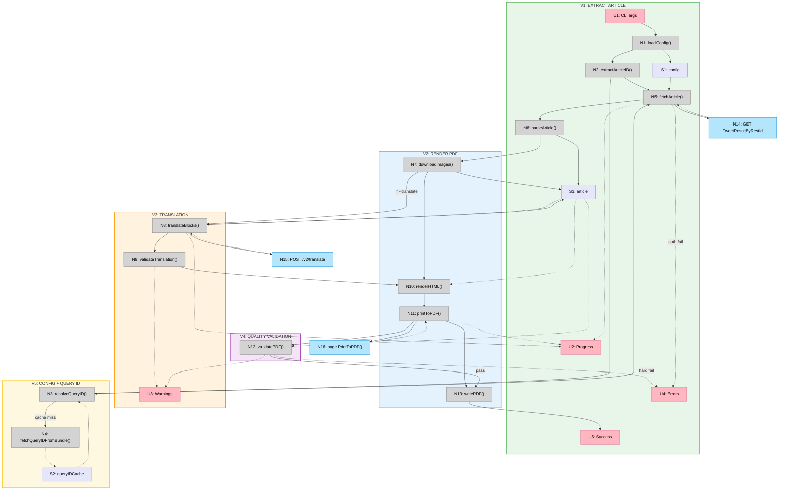

# Shape A — Slices

## Slice Summary

| # | Slice | Mechanism | Demo |
|---|-------|-----------|------|
| V1 | Extract article | A1 (content extraction) | "Run command with URL + auth flags, see article summary in terminal" |
| V2 | Render PDF | A3 (PDF rendering) | "Run command, get a well-formatted PDF" |
| V3 | Translation | A2 (translation) | "Run with `--translate de`, get German PDF" |
| V4 | Quality validation | A4 (quality validation) | "Run command, see validation pass/warnings before output" |
| V5 | Config + query ID | R5, A1 partial (query ID resolution) | "Config file replaces flags, query ID auto-resolves" |

---

## V1: Extract Article

**Demo:** `x-article-exporter https://x.com/i/article/123456 --auth-token abc --ct0 xyz` → prints article title, author, date, block count, image count to terminal.

**Notes:**
- Query ID is hardcoded (will rotate in 2-4 weeks — acceptable for first slice)
- `--auth-token` and `--ct0` are required flags (no config file yet)
- No PDF output — terminal summary only
- No image download (not needed for summary)

**New affordances:**

| # | Place | Component | Affordance | Control | Wires Out | Returns To |
|---|-------|-----------|------------|---------|-----------|------------|
| U1 | P1 | — | CLI args: `<url> --auth-token <t> --ct0 <c>` | invoke | → N1 | — |
| U2 | P1 | — | Progress log | render | — | — |
| U4 | P1 | — | Error messages (exit 1) | render | — | — |
| U5 | P1 | — | Article summary (exit 0) | render | — | — |
| N1 | P2 | config | `loadConfig(flags)` — parse CLI flags only, no config file | call | — | → S1 |
| N2 | P2 | extract | `extractArticleID(url)` | call | — | → N5 |
| N5 | P2 | extract | `fetchArticle(articleID, queryID, config)` — hardcoded query ID | call | → N14 | → N6 |
| N6 | P2 | extract | `parseArticle(response)` | call | — | → S3 |
| N14 | P3 | — | `GET TweetResultByRestId` | call | — | → N5 |
| S1 | P2 | — | `config` (from flags only) | store | — | — |
| S3 | P2 | — | `article` (metadata + blocks) | store | — | → U5 |

---

## V2: Render PDF

**Demo:** `x-article-exporter https://x.com/i/article/123456 --auth-token abc --ct0 xyz --output ./article.pdf` → writes a well-formatted, self-contained PDF to disk.

**Notes:**
- Images downloaded and base64-embedded in HTML (MEDIA entities resolved via `media_entities[]`)
- Go HTML template with CSS print media, embedded OpenSans variable font
- Block grouping: consecutive list items → `<ul>`/`<ol>`, code blocks → `<pre><code>`, blockquotes → `<blockquote>`
- Boundary-based styled text renderer (handles overlapping Bold/Italic/Code/Link/Strikethrough ranges, case-insensitive)
- Newlines within blocks converted to ` ` tags
- chromedp `PrintToPDF` with page numbers, h1/h2 `break-before: page`
- Self-contained HTML always saved alongside PDF (diffable, shareable via Slack)
- Output file path via `--output` flag (default: `./{title}.pdf` + `.html`)

**New affordances:**

| # | Place | Component | Affordance | Control | Wires Out | Returns To |
|---|-------|-----------|------------|---------|-----------|------------|
| N7 | P2 | extract | `downloadImages(blocks)` — fetch + base64-encode | call | — | updates S3 |
| N10 | P2 | render | `renderHTML(article, blocks)` — Go template + CSS | call | — | → N11 |
| N11 | P2 | render | `printToPDF(html)` — chromedp SetDocumentContent + PrintToPDF | call | → N16 | → N13 |
| N13 | P6 | output | `writePDF(pdfBytes, outputPath)` | call | writes P6 | → U5 |
| N16 | P5 | — | `page.PrintToPDF()` — Chrome DevTools Protocol | call | — | → N11 |

---

## V3: Translation

**Demo:** `x-article-exporter https://x.com/i/article/123456 --auth-token abc --ct0 xyz --translate de --deepl-key KEY` → PDF in German with code blocks/LaTeX preserved unchanged.

**Notes:**
- `--translate <lang>` and `--deepl-key <key>` flags added
- XML tag handling with `ignore_tags` for code/LaTeX
- Translation validation runs automatically: block count, code byte-identity, length ratio ±30%
- Soft warnings printed to terminal, hard failures exit 1

**New affordances:**

| # | Place | Component | Affordance | Control | Wires Out | Returns To |
|---|-------|-----------|------------|---------|-----------|------------|
| U3 | P1 | — | Validation warnings (translation length ±30%) | render | — | — |
| N8 | P2 | translate | `translateBlocks(blocks, targetLang, apiKey)` | call | → N15 | updates S3 |
| N9 | P2 | translate | `validateTranslation(original, translated)` | call | — | → U3, → U4 |
| N15 | P4 | — | `POST /v2/translate` — DeepL API | call | — | → N8 |

---

## V4: Quality Validation

**Demo:** `x-article-exporter ...` → after PDF render, validation output: "PDF valid. 4 pages. 3 images (expected 3). Title found. Author found. Word count: 1847 (expected ~1800). OK."

**Notes:**
- Runs automatically after every `printToPDF` (<200ms overhead)
- `pdfcpu`: structural integrity, page count, image count
- `ledongthuc/pdf`: text extraction for title/author present, word count ±15%
- U3 extended with PDF validation warnings (word count off, image count mismatch)
- Hard failures (missing title, PDF corrupt) → U4 (exit 1)
- Soft warnings (word count slightly off) → U3 (exit 0)

**Nice-to-have ideas (from V2 E2E feedback):**
- **Per-article settings JSON**: A small JSON file alongside the article that overrides rendering settings (e.g., image max-width, page break locations, font size tweaks) for per-article taste adjustments. Each article has unique "sharp edges" that only manual tweaks can fix.
- **Golden file testing**: Use the HTML output (pre-PDF) as golden files for regression/integration tests. The HTML is clean and deterministic, making it ideal for diffing.

**New affordances:**

| # | Place | Component | Affordance | Control | Wires Out | Returns To |
|---|-------|-----------|------------|---------|-----------|------------|
| N12 | P2 | validate | `validatePDF(pdfBytes, article, blocks)` — pdfcpu + ledongthuc/pdf | call | — | → U3, → U4, → N13 |

**Changed wiring:** N11 now wires to N12 instead of directly to N13. N12 gates output: pass → N13, hard fail → U4.

---

## V5: Config File + Query ID Resolution

**Demo:** Create `~/.config/x-article-exporter/config.yaml` with `auth_token` and `ct0`. Run `x-article-exporter https://x.com/i/article/123456` without auth flags — works. Query ID auto-resolves from X's JS bundles, cached for 24h.

**Notes:**
- Config file loading: `~/.config/x-article-exporter/config.yaml`
- CLI flags override config file values
- `--auth-token`, `--ct0`, `--deepl-key` become optional (config provides them)
- `--query-id` added as manual override fallback
- Query ID resolution: cache (S2, 24h TTL) → fetch from JS bundle (N4) → `--query-id` flag
- Replaces hardcoded query ID from V1

**New affordances:**

| # | Place | Component | Affordance | Control | Wires Out | Returns To |
|---|-------|-----------|------------|---------|-----------|------------|
| N1 | P2 | config | `loadConfig(flags, configPath)` — **extended**: reads config.yaml + merges with flags | call | reads P6 | → S1 |
| N3 | P2 | extract | `resolveQueryID(config)` — cache → bundle → fallback | call | → N4 (miss) | → N5 |
| N4 | P3 | extract | `fetchQueryIDFromBundle()` — GET main.js → api chunk → regex | call | — | → S2, → N3 |
| S2 | P6 | — | `queryIDCache` — 24h TTL, `~/.cache/x-article-exporter/query-id.json` | store | — | → N3 |

**Changed wiring:** N2 (extractArticleID) now wires to N3 (resolveQueryID) instead of directly to N5. N3 wires to N5 with the resolved query ID.

---

## Sliced Breadboard

---

## Slices Grid

|  |  |  |
|:--|:--|:--|
| **V1: EXTRACT ARTICLE** ✅ COMPLETE  • Parse CLI args (url, --auth-token, --ct0) • Extract snowflake ID from URL • Fetch article via TweetResultByRestId (hardcoded query ID) • Parse Draft.js content_state blocks  *Demo: Run command, see article summary in terminal* | **V2: RENDER PDF** ✅ COMPLETE  • Download + base64-encode images • Go HTML template + CSS print media • chromedp PrintToPDF with page numbers • Embedded OpenSans font, HTML + PDF output  *Demo: Run command, get HTML + PDF* | **V3: TRANSLATION** ⏳ PENDING  • --translate and --deepl-key flags • DeepL API with XML tag handling • ignore_tags for code/LaTeX • Translation validation (block count, byte-identity, length)  *Demo: Run with --translate de, get German PDF* |
| **V4: QUALITY VALIDATION** ⏳ PENDING  • pdfcpu: structural integrity, page count, image count • ledongthuc/pdf: text extraction • Title/author present, word count ±15% • Soft warnings vs hard failures  *Demo: Run command, see validation pass/warnings* | **V5: CONFIG + QUERY ID** ⏳ PENDING  • Config file (~/.config/x-article-exporter/config.yaml) • CLI flags override config values • Query ID: cache (24h) → bundle extraction → manual • Auth flags become optional  *Demo: Config file works, query ID auto-resolves* | |
