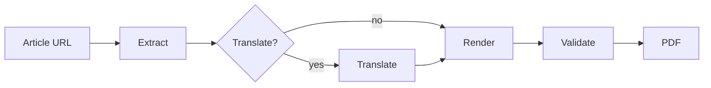
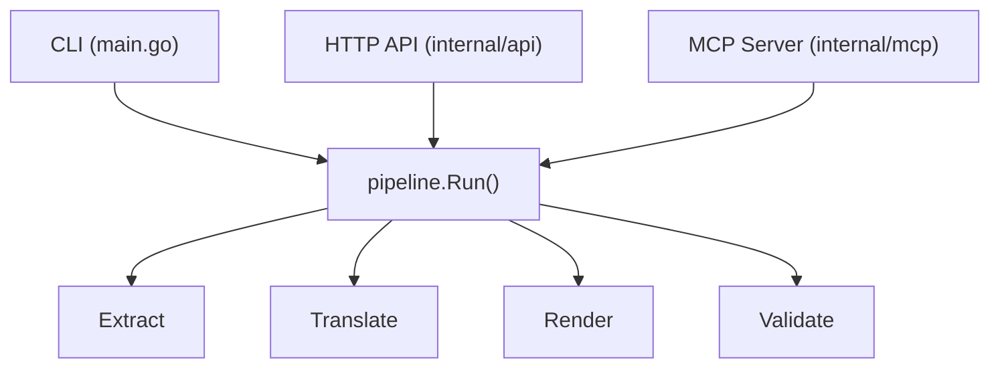

X Article Exporter uses a four-stage pipeline to turn an X article URL into a validated PDF.

## Pipeline overview



## Stage 1: Extract

Fetches the article via X's internal GraphQL API using the `TweetResultByRestId` operation. X articles are stored as special tweet types — the article URL's snowflake ID is a tweet ID.

The response contains a [Draft.js](https://draftjs.org/) `RawDraftContentState` document with:

- **Blocks** — paragraphs, headings (H2/H3), code blocks, blockquotes, ordered/unordered lists
- **Inline styles** — bold, italic, strikethrough, code spans
- **Entity map** — media (images), links, twemoji, markdown entities

The extractor parses this into an internal article model with typed content blocks, author info, title, and cover image.

## Stage 2: Translate (optional)

When `--translate <lang>` is specified, all translatable text blocks are sent to a local [Ollama](https://ollama.com) instance running `translategemma:12b`.

Blocks are batched with `[N]` delimiters to minimize API round trips. Non-translatable content (code blocks, LaTeX, URLs) is preserved as-is. The translation operates on plain text extracted from the article model, then the translated text is inserted back into the block structure.

## Stage 3: Render

Generates [Typst](https://typst.app) source from the article model and compiles it to PDF.

The renderer handles:

- Page layout (US letter, margins, page numbers)
- Typography with embedded Open Sans fonts (static TTFs via `go:embed`)
- Dark mode (`#set page(fill: rgb("#000"))` + light text)
- Images decoded from base64 data URIs to temp files
- Blockquotes with left-border styling
- Inline markup that respects Typst's newline constraints

Typst compilation produces the final PDF via `typst compile`.

## Stage 4: Validate

Two-tier quality validation ensures PDF correctness without manual inspection:

1. **Structural check** — `pdfcpu.ValidateFile()` verifies the PDF is well-formed
2. **Content check** — Text extraction via `ledongthuc/pdf` verifies title, author, and content are present; word count within expected range

The validator handles Typst's incomplete text extraction (~29% of words recoverable) via a `poorExtraction` threshold.

## Interfaces

The pipeline is extracted into `internal/pipeline` and reused across all three interfaces:



| Interface | Entry point | Description |
|-----------|------------|-------------|
| [CLI](../docs/cli) | `main.go` | Direct command-line usage |
| [HTTP API](../docs/api) | `internal/api` | Async job processing with auth and rate limiting |
| [MCP Server](../docs/mcp) | `internal/mcp` | Claude Code integration via stdio JSON-RPC |

## Package structure

```
x-article-exporter/
  main.go              # CLI entry point, dispatches to pipeline/server/MCP
  internal/
    api/               # HTTP server with export endpoints, bearer auth, rate limiting
    config/            # CLI flag parsing, YAML config loading, flag-over-file merge
    extract/           # TweetResultByRestId GraphQL client, query ID resolution
    images/            # Downloads article images, converts URLs to base64 data URIs
    jobs/              # Async job execution, bounded concurrency, TTL cleanup
    mcp/               # MCP stdio server with 4 tools for Claude integration
    model/             # Article struct, Draft.js content blocks, entity types
    pipeline/          # Orchestrates fetch → parse → translate → render → validate
    render/            # HTML template + Typst source generation, PDF compilation
      fonts/           # Embedded Open Sans TTFs (go:embed)
    translate/         # Ollama batch translation with numbered block delimiters
    validate/          # PDF checks via pdfcpu + ledongthuc/pdf, graceful degradation
```
